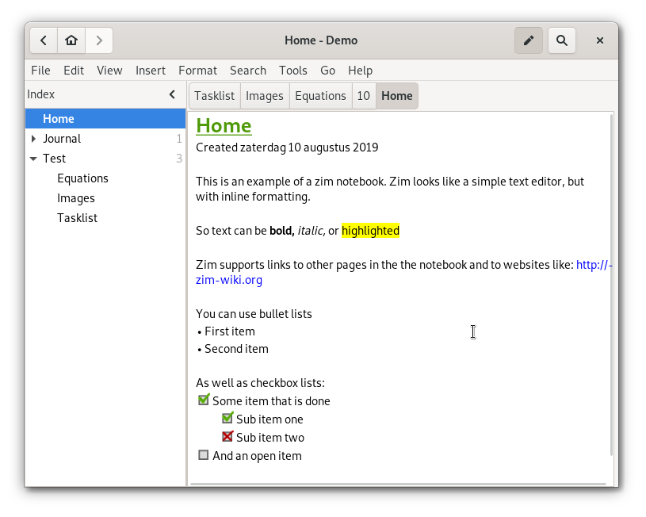

Zim - A Desktop Wiki Editor
===========================

Zim is a graphical text editor used to maintain a collection of wiki pages. Each
page can contain links to other pages, simple formatting and images. Pages are
stored in a folder structure, like in an outliner, and can have attachments.
Creating a new page is as easy as linking to a nonexistent page. All data is
stored in plain text files with wiki formatting. Various plugins provide
additional functionality, like a task list manager, an equation editor, a tray
icon, and support for version control.

Zim can be used to:
* Keep an archive of notes
* Keep a daily or weekly journal
* Take notes during meetings or lectures
* Organize task lists
* Draft blog entries and emails
* Do brainstorming

## Installing from a Package

Most linux distributions include zim in their package repository. On debian and
ubuntu to package is simply called "zim".

A windows installer can be found here: https://zim.glump.net/windows/

## Installing from Source

**NOTE:** To test zim it is not needed to install. You should be able to run it
directly from the source directory by calling `./zim.py`. (To run a translated
version from the source first call `./setup.py build_trans`.)

First you should verify you have the dependencies zim needs. To list all dependencies check `./setup.py --requires`.

You will at least need the following:

* Gtk+ >= 3.18
* python3 >= 3.2
* python3-gi (also known as pygobject, but make sure to have the "gi" based version)
* python3-xdg (optional, but recommended)
* xdg-utils (optional, but recommended)

To verify zim is working properly on your system you can call the test suite using `./test.py`. Failures do not have to be critical, but in principle all tests should pass.

Zim can be installed from source using:

    ./setup.py install

Most plugins have additional requirements. These are listed in the plugin descriptions.

### Ubuntu

On Ubuntu or other debian derived systems, the following packages should be installed:

* python3
* gir1.2-gtk-3.0
* python3-gi
* python3-xdg

### Windows

On windows the "msys" environment can be used to install python3 with Gtk and
run zim from source. See https://www.gtk.org/download/windows.php for detailed
instructions.

Make sure to include the python bindings as well.

*Note:* after installation the "msys" environment offers a "32" and a "64" bit
shell. When you installed the "64" packages for Gtk, they will only run from
the "64" shell.

### Mac OS X

You can run zim on mac if you have the proper dependencies installed.

If you are using Mac Ports packages installing the following ports should work:

TODO: new instructions for Gtk3 / Python3

If you are using [Homebrew package manager](https://brew.sh/), the proper dependencies can be installed using

`brew install python gtk+3 pygobject3`

Once done, install

`brew install zim`

Then run from terminal

`zim`

Or [make a wrapper app](https://github.com/jaap-karssenberg/zim-wiki/wiki/Mac-OSX-App-%28wrapper%29) for Zim so that you can keep it in the launcher and open it as a native Mac OSX app.

### Install Paths

If you install in a non-default location you may need to set the PYTHONPATH environment variable in order for zim to find it's python modules. For example, if you installed the modules below "/home/user/lib/zim" you need to set:

    PYTHONPATH=/home/user/lib

Also zim uses the XDG paths to locate data and config files. If you get an error that zim can not find it's data files For example, if you installed the zim data files to "/home/user/share/zim" you need to set the data path like this:

    XDG_DATA_DIRS=/home/user/share:/usr/local/share:/usr/share

## Contributing

See [CONTRIBUTING](./CONTRIBUTING.md) and [PLUGIN_WRITING](./PLUGIN_WRITING.md)
for information on contributing to the zim source code, translations and
documentation.

## Copyright and License

Zim is an open source program. This means it can be used and distributed freely
under the conditions of the [license](./LICENSE).

All files in this package, with the exception of those mentioned below are
copyrighted by Jaap Karssenberg <jaap.karssenberg@gmail.com>

Translations are copyrighted by their respective translators. All translations
that are entered through the launchpad website are distributed under the BSD
license. See the translation files for detailed translator credits.

The following files were included from other sources:
* `zim/inc/xdot.py` - Copyright 2008 Jose Fonseca
* `zim/inc/arithmetic.py` - Copyright 2010, 2011 Patricio Paez
* From the default Gnome icon theme:
  * `pixmaps/task-list.png` (was: `stock_todo.png`)
  * `pixmaps/attachment.png` (was: `mail-attachment.png`)
* From Gtk+ 2.8
  * `pixmaps/link.png` (was: `stock_connect_24.png`)
* `pixmaps/calendar.png` (was: `stock_calendar-view-month.png`)
  Copyright 2007 by Jakub Steiner, released under GPL
  modifications copyright 2009 by Gabriel Hurley
